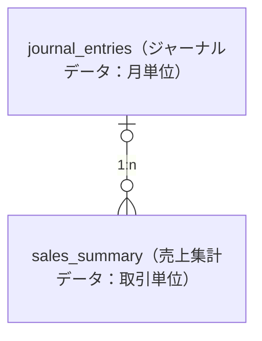

# 調査レポートベストプラクティス

既存コードの調査結果を効果的に報告するためのパターンとベストプラクティス集。

## アクティベーションタイミング

- 既存機能の調査時
- バグの原因特定時
- パフォーマンス問題の分析時
- アーキテクチャの理解・ドキュメント化時
- リファクタリング前の影響調査時
- 新規機能開発のための既存機能理解時

## レポート作成のベストプラクティス

### 実例に基づく具体的な記述

- **チケットへのリンク**: Redmine、Jira、GitHub Issue等の具体的なリンク
- **コードへの直接リンク**: GitLabやGitHubの行番号付きリンク
- **過去の議論の引用**: Slackやチケットの議論を参照
- **データで裏付け**: BigQueryクエリ結果、ログ分析結果を提示

### MECE原則（Mutually Exclusive, Collectively Exhaustive）

- **相互排他的**: 重複のない分類
- **完全網羅的**: 漏れのない調査

### ピラミッド原則

```

結論
├── 理由1
│   ├── 根拠1-1
│   └── 根拠1-2
├── 理由2
│   ├── 根拠2-1
│   └── 根拠2-2
└── 理由3

```

### 5W1Hの活用

- **What**: 何を調査したか
- **Why**: なぜ調査したか
- **Who**: 誰が影響を受けるか
- **When**: いつ対応するか
- **Where**: どこに問題があるか
- **How**: どう解決するか

### データドリブン

```markdown
## パフォーマンス問題

❌ 悪い例:
「レスポンスが遅い」

✅ 良い例:
「レスポンス時間が平均3.2秒（目標500ms）、P95で5.8秒を記録」
```

### 視覚化の活用

**使い分けガイド**:

- **フローチャート**: 処理の流れ
- **シーケンス図**: 時系列の相互作用
- **ER図**: データ構造
- **グラフ**: 時系列データ、比較
- **テーブル**: 構造化された情報

### 過去の議論の引用

```markdown
## プロモコード自動適用の仕組みがある

- 以下のチケットで実装された機能
  - 過去のチケット#567
- ABテスト用のプロモコードがあるらしい
- いずれのプロモコードも`2019年期限` だったので不要な仕組みだと思われる

**対応方針:**

- 👉自動適用の仕組みは実質的にデッドコードなので撤去する
```

### デッドコードの特定

```markdown
## `data_summary` テーブルの利用目的と関係者

- 管理画面の`売上レポート`からダウンロードできるCSVファイルのローデータとして参照されている
- 主なステークホルダーは経理チームだが、過去に確認したところ誰も使ってない機能ということになり、月次レポート機能を停止したらしい
  - 過去の議論へのリンク
- しかし、`data_summary`を生成する`generate_summary.rb` はまだ動き続けている状況（== 無意味なデータ生成）
- 👉将来的に撤去予定
```

### 段階的な対応方針

```markdown
## リプレース方針

- リプレース作業を段階的に実施する
  - `Order.promo` の参照箇所を個別に`Order.promos`にリプレース
  - `Order.promo`の参照箇所がなくなったら撤去
- テスト方法を現実的な範囲に調整
  - 複数プロモコードデータではテストしない
  - 単一プロモコードでテストする
  - `Order.promo` を撤去したら複数プロモコードデータで再度テストする
```

### 実装工数の比較

```markdown
## `完全撤去 OR コード修正`の工数感

- 撤去するにしてもアナウンス調整や撤去作業、古いクライアントでの挙動調査などで時間が掛かりそう
  - 過去の議論へのリンク
- コード修正で検討してみる

**対応方針:**

- 👉コード修正の方が現実的
```

### 動作確認の記録

```markdown
## getUserPromoSummary メソッド

- 👉対応不要だった
- ソースコード
  - [src/services/promo_service.rb#L153](リポジトリへのリンク)
- メソッドの役割
  - プロモコード利用された注文数をカウントしている
  - `promos → orders` でJOINしているが現状のままでも動作に問題なし
- 動作テスト
  - 管理画面の`プロモコード管理 > 詳細`にアクセスして、利用件数を正しくカウントできていることを確認
  - テスト環境URL: https://admin.test.example.com/promos/123
    
```

### ER図を使った関係性の整理

```markdown
## `data_summary` テーブルの利用目的と関係者

- 管理画面の`売上レポート`からダウンロードできるCSVファイルのローデータとして参照されている

    ```mermaid
    erDiagram
        report_templates（レポートテンプレート） |o--o{ data_summary（データ集計：単位毎） : "1:n"
    ```

- 主なステークホルダーは経理チームだが、過去に確認したところ誰も使ってない機能ということになり、月次レポート機能を停止したらしい
  - 過去の議論へのリンク

**対応方針:**

- 👉将来的に撤去予定だが、不整合なクエリを残したくないので修正しておく
```

**ポイント**: ER図でテーブル間の関係性を可視化し、ステークホルダーや利用状況を明確化

### 将来的な撤去予定機能への対応

```markdown
## `data_summary` テーブルの利用状況

- 👉将来的に撤去予定とのことだが、不整合なクエリが残っていると煩わしいので修正しておく
  - 過去の議論へのリンク

## 対応方針

- 撤去予定の機能・テーブルだが、不整合なクエリを残したくないので修正しておく
  - `LEFT OUTER JOIN`ではなく、`条件付きのLEFT OUTER JOIN`に書き換える
  - `payment_amount` の計算で複数プロモコードの金額を減算できるようにする
```

**ポイント**: 撤去予定でも、現在の不整合を放置せずに修正する姿勢

### メールテンプレートの調査

```markdown
## メールテンプレート

- テンプレートID: 510

    ```sql
    SELECT *
    FROM email_templates
    WHERE template_id = 510;
    ```

    結果:
    
    ```json
    [{
      "template_id": 510,
      "subject": "Data integrity check results",
      "body": "Invalid data list:\n\n{{invalid_promo_data}}\n\n..."
    }]
    ```

## 対応方針

- メールテンプレートの修正
  - `{{invalid_promo_data}}` プレースホルダーを撤去
  - 関連チケットリストに今回の作業チケットを追加
```

**ポイント**: メールテンプレートも調査対象に含め、修正が必要な箇所を特定

### 絵文字（👉⚠️等）の使用ルール

**原則: 絵文字は「強調」のために使用する。全項目に同じ絵文字を付けると意味がなくなる。**

**使用すべき場合（1セクションにつき最大1-2箇所）:**

- 最も重要な結論・推奨アクション（セクション内で1つだけ）
- 重要な意思決定ポイント（撤去 vs 修正の最終判断など）
- リスクの高い変更への警告（⚠️を使用）

**使用してはいけない場合:**

- すべての箇条書きに同じ絵文字を付ける（絵文字の意味が薄れる）
- 単純な事実の羅列
- 複数の選択肢を列挙する場合（結論の1つだけに付ける）

```markdown
## 悪い例（全項目に絵文字）

- 👉Native SQLに変更する
- 👉D_COUPONテーブルへのJOINを追加する
- 👉MySQLとSQL Serverの両方に対応する
- 👉戻り値の型は変更不要

## 良い例（結論のみに絵文字）

- Native SQLに変更し、D_COUPONテーブルへのJOINを追加する
- MySQLとSQL Serverの両方に対応する
- 戻り値の型は変更不要
- 👉ただし、呼び出し元で使用されていないため、撤去の方が適切
```

```markdown
## 良い例（警告に絵文字）

- ⚠️既存の価格ルールを削除しないでください
- 不要になった価格ルールは`enabled: false` に変更して無効化すること
```

```markdown
## 対応方針まとめ（絵文字なしでシンプルに）

- `SUM(d.coupon) AS coupon` の行を削除する
- `D_COUPON`への参照切り替えは不要（使用されていないため）
- 呼び出し元への影響なし
```

## レポートパターン集

### パターン1: テーブル移行に伴うレガシーAPIの調査レポート

テーブルスキーマ変更に伴う旧APIのアクセス状況調査、デッドコードの特定と撤去方針の策定。

```markdown
# 目的

- [#1234 Legacy API endpoint investigation](チケットシステムへのリンク)
- 新方式データベーススキーマ対応のため、旧API（`/api/v1/legacy/add`）の調査と対応方針の策定

# 調査ログ

## アクセス状況を調査

- アクセスログ分析

    ```sql
    SELECT
      DATE(timestamp) AS date,
      user_agent,
      endpoint,
      COUNT(*) AS access_count
    FROM
      access_logs
    WHERE
      timestamp BETWEEN '2026-01-01' AND '2026-01-10'
      AND endpoint LIKE '%/api/v1/legacy/add%'
    GROUP BY
      date,
      user_agent,
      endpoint
    ORDER BY
      date ASC,
      access_count DESC
    ```

    結果: 10日間で11件のアクセス

**対応方針:**

- 👉若干数のアクセスはあるが撤去可能かもしれない
- 👉撤去よりもコード修正の方が現実的（アナウンス調整や古いクライアントでの挙動調査で時間がかかる）

## `/api/v1/legacy/add` について

- [src/controllers/api/legacy_controller.rb#L88-101](リポジトリへのリンク)
- `/api/v1/legacy/add` では`プロモコード適用のパラメータ`は存在しない
- 内部的なプロモコード自動適用の仕組みはあるが、ほぼデッドコードと思われる
  - [src/services/cart_service.rb#L204](リポジトリへのリンク)

**対応方針:**

- 👉`SELECT, UPDATE`の向け先テーブルを新方式に切り替えるだけで良さそう

## プロモコード自動適用の仕組みがある

- 以下のチケットで実装された機能
  - 過去のチケット#567
- ABテスト用のプロモコードがあるらしい
- いずれのプロモコードも`2019年期限` だったので不要な仕組みだと思われる

    ```sql
    SELECT
      code_id,
      code,
      expiry_date,
      status,
      description
    FROM
      promo_codes
    WHERE
      code_id IN (1001, 1002, 1003, ...)
      AND expiry_date < CURRENT_DATE
    ```

    結果: すべて期限切れ

**対応方針:**

- 👉自動適用の仕組みは実質的にデッドコードなので撤去する

## 対応方針まとめ

- デッドコードを撤去する
  - `プロモコード自動適用の仕組み`を撤去
  - `user_cart.promo_code`への`UPDATE・INSERT`を撤去
  - `user_cart.promo_code` への`SELECT`を撤去
- カート機能におけるプロモコード情報を参照する必要がなくなるので、新方式のテーブル（`cart_promos`）へのSELECTなどは発生しない想定
```

### パターン2: テーブル移行に伴うレガシーコードの対応要否調査レポート

テーブルスキーマ変更に伴う既存コード（JOIN処理等）への影響調査と対応要否の判断。

```markdown
# 目的

- [#5678 テーブル移行に伴うJOIN処理の影響調査](チケットシステムへのリンク)

# 調査ログ

## calculateUserSummary メソッド

- 👉対応不要だった
- ソースコード
  - [src/services/report_service.rb#L153](リポジトリへのリンク)
- メソッドの役割
  - ユーザーの集計データを計算している
  - `table_a → table_b` でJOINしているが現状のままでも動作に問題なし
- 動作テスト
  - 管理画面の`レポート > 詳細`にアクセスして、集計値を正しく表示できていることを確認
  - テスト環境URL: https://admin.test.example.com/reports/123
    

## getDataList メソッド

- 👉対応不要だった
- ソースコード
  - [src/services/report_service.rb#L266](リポジトリへのリンク)
- メソッドの役割
  - 一覧表示に必要なデータとして、関連情報を抽出している
  - `table_a → table_b` でJOINしているが現状のままでも動作に問題なし
- 動作テスト
  - 管理画面の`データ管理`にアクセスして正しくリスト表示を確認
  - テスト環境URL: https://admin.test.example.com/data
    

## getActiveItems メソッド

- 👉対応不要だった
- ソースコード
  - [src/services/report_service.rb#L387](リポジトリへのリンク)
- メソッドの役割
  - ユーザー画面にて、有効なアイテムを描画するためのメソッド
  - `table_a → table_b`でJOINしているが、SELECT句で参照していないので無駄なJOINとなっている
  - 現状のままで機能的には問題なし
- 動作テスト
  - `ユーザー画面`にアクセスして有効なアイテムを描画できることを確認
  - テスト環境URL: https://app.test.example.com/users/12345
    

## 対応方針まとめ

- すべてのメソッドで`table_a → table_b` のJOINは現状のままで動作に問題なし
- 👉一部のメソッドで無駄なJOINとなっているが、パフォーマンス影響は軽微なため優先度は低い
```

### パターン3: エラー調査とリプレース方針検討レポート

アプリケーションエラーの原因特定と段階的なリプレース方針の策定。

```markdown
# 目的

- [#9012 Multiple promo codes causing errors](チケットシステムへのリンク)

# 作業ログ

## 複数割引コード適用時に詳細画面でエラーになる

- 該当データ:
  - 管理画面: https://admin.test.example.com/orders/123456
- `Order → Discount` のアソシエーション定義が原因
  - [src/models/Order.java#L176-178](リポジトリへのリンク)

        ```java
        @ManyToOne(targetEntity = Discount.class, fetch = FetchType.LAZY)
        @JoinColumn(name = "order_id", referencedColumnName = "order_id", insertable = false, updatable = false)
        private Discount discount;
        ```

  - ORMは`Discount`が`1件`を期待するのに`2件以上` 返却されることで`More than one rowエラー`が生じている状態
- `フィールド参照（Order.discount）`と、`getter/setter参照（getDiscount, setDiscount）` でアソシエーションを利用しており、参照されたタイミングで例外をスローしてしまう
  - フィールド参照例：[src/models/Order.java#L262](リポジトリへのリンク)
- アソシエーション自体は`FetchType.LAZY` なのでOrderインスタンスが生成されるだけではエラーにならないが、参照メソッドが呼ばれた時点でエラーとなる
- 👉既存のアソシエーションを撤去するまでエラー解消は不可能

## リプレース方針

- アソシエーション定義を`Order.discount → Order.discounts` にリプレースする
- リプレース作業を段階的に実施する
  - `Order.discount` の参照箇所を個別に`Order.discounts`にリプレース
  - `Order.discount`の参照箇所がなくなったら撤去
- `Order.discount` を撤去するまで上述のエラーは解消できないので、テスト方法を妥協する
  - 複数割引コードデータではテストしない
  - 単一割引コードでテストする
  - `Order.discount` を撤去したら複数割引コードデータで再度テストする

**対応方針:**

- 👉段階的なリプレースにより安全に移行
- 👉テスト方法を現実的な範囲に調整
```

### パターン4: 運用フロー・設計ドキュメント

機能の運用フローや設計方針を詳細にまとめる大規模ドキュメント。

```markdown
# 目的

- [#3456 Pricing rule configuration](チケットシステムへのリンク)
- 価格ルールマスターファイルの運用フローを整理しておく

# 概要

- 以下の価格ルールマスターファイルに記述した内容が、動的価格設定のルールとして反映されます
  - [config/pricing_rules.yml](リポジトリへのリンク)

# 本番化手順

- `通常の本番化手順`で価格ルールマスターファイルの修正内容を本番化してください
- ⚠️YAMLの記述エラーによる本番影響も考えられるので、テスト環境で必ず動作確認すること

# YAMLファイルの記述方法

## 対象商品を指定する

- ⚠️各フィールドは省略せずに必ず記述してください（省略不可）

### カテゴリで絞り込み（`category_ids`）

- カテゴリIDを複数指定できる（`categories.id`）
  - 親カテゴリ、子カテゴリで指定可能

    ```yaml
    # 子カテゴリで指定した場合
    category_ids: [101, 102]
    
    # 親カテゴリで指定した場合
    category_ids: [10] # 配下のすべてのカテゴリを指定
    ```

- `カテゴリを指定しない場合`は`category_ids: []` と記述すること

## 既存の価格ルールを無効化する

- ⚠️**既存の価格ルールを削除しないでください**
- 不要になった価格ルールは`enabled: false` に変更して無効化すること（**厳守**）

    ```yaml
    - id: 1
      category_ids: [101]
      promo_rate: 10
      enabled: false # ✅true -> false に変更
    ```

## 価格ルールの優先順位

- 1つの商品に適用される価格ルールは`最大1つまで`
- 商品が複数の価格ルールにマッチする場合は、価格ルールマスターファイルの`記載順に優先`する仕様

    ```yaml
    - id: 1
      category_ids: [50]
      promo_rate: 10
      enabled: true
    
    - id: 2
      category_ids: [50]  # id: 1と重複するが、id: 1が優先される
      promo_rate: 15
      enabled: true
    ```

  - 👉`category_id: 50` の商品には、`id: 1`の価格ルール（10%割引）が適用される
```

### パターン5: バッチ処理調査レポート

バッチ処理やデータ集計処理の調査と修正方針。

```markdown
# 目的

- [#7890 Daily sales aggregation batch](チケットシステムへのリンク)

# 作業ログ

## `generate_summary.rb` とは

- 売上集計バッチのこと
- `毎月1日の午前2時` にバッチ実行される
  - [config/cron/monthly_jobs.yml#L15](リポジトリへのリンク)

## `saveAggregateData` メソッド

- `配送完了`の注文データの集計結果を`data_summary` テーブルにインサートしている
  - [src/batch/generate_summary.rb#L80](リポジトリへのリンク)
- SELECT内容
  - `user_promo`: ユーザープロモコードの金額
  - `system_promo`: システムプロモコードの金額
  - `payment_amount`: 注文金額から利用プロモコードの金額を差し引いた金額

**対応方針:**

- 👉複数プロモコード適用した注文では、すべてのプロモコードの金額を差し引けるように要修正

## `data_summary` テーブルの利用目的と関係者

- 管理画面の`売上レポート`からダウンロードできるCSVファイルのローデータとして参照されている
- 主なステークホルダーは経理チームだが、過去に確認したところ誰も使ってない機能ということになり、月次レポート機能を停止したらしい
  - 過去の議論へのリンク
- しかし、`data_summary`を生成する`generate_summary.rb` はまだ動き続けている状況（== 無意味なデータ生成）
- 👉将来的に撤去予定とのことだが、不整合なクエリが残っていると煩わしいので修正しておく

## 対応方針

- 撤去予定の機能・テーブルだが、不整合なクエリを残したくないので修正しておく
  - `LEFT OUTER JOIN`ではなく、`条件付きのLEFT OUTER JOIN`に書き換える
  - `payment_amount` の計算で複数プロモコードの金額を減算できるようにする
```

## 実例から学ぶ重要なテクニック

### アクセス状況の定量分析

```markdown
## アクセス状況を調査

- BigQuery

    ```sql
    SELECT
      _TABLE_SUFFIX AS date,
      agent,
      COUNT(*) AS cnt
    FROM `project.dataset.table_*`
    WHERE _TABLE_SUFFIX BETWEEN '20260101' AND '20260110'
      AND path LIKE '%/api/cart/ssladd%'
    GROUP BY date, agent
    ORDER BY date ASC, cnt DESC
    ```

    結果: 10日間で11件のアクセス

- 👉若干数のアクセスはあるが撤去可能かもしれない
```

**ポイント**: 推測ではなく実際のログデータで判断

### デッドコードの特定方法

```markdown
## プロモコード自動適用の仕組みがある

- 以下のチケットで実装された機能
  - 過去のチケット#567
- いずれのプロモコードも`2019年期限` だったので不要な仕組みだと思われる

    ```sql
    SELECT code_id, code, expiry_date, status
    FROM promo_codes
    WHERE code_id IN (1001, 1002, 1003, ...)
      AND expiry_date < CURRENT_DATE
    ```

    結果: すべて期限切れ

**対応方針:**

- 👉実質的にデッドコードなので撤去する
```

**ポイント**: データベースクエリで実際のデータを確認してデッドコードを特定

### バグの根本原因の特定

```markdown
## データ整合性チェック処理

- `orders.promo_amount`に金額が入っているのに`promos` が存在しないケースをチェックしている
  - [src/batch/check_data_integrity.rb#L164-167](リポジトリへのリンク)
- しかし、`NULLチェック`と`値チェック`をANDで実施しており、必ず`false`になるため機能していない
  - [src/batch/check_data_integrity.rb#L166-171](リポジトリへのリンク)

**対応方針:**

- 👉機能していないので撤去する
```

**ポイント**: コードを読んで論理的な矛盾を発見

### 工数比較による意思決定

```markdown
## `完全撤去 OR コード修正`の工数感

- 撤去するにしてもアナウンス調整や撤去作業、古いクライアントでの挙動調査などで時間が掛かりそう
  - 過去の議論へのリンク
- コード修正で検討してみる

**対応方針:**

- 👉コード修正の方が現実的
```

**ポイント**: 複数の選択肢を比較して現実的な方針を選択

### ステークホルダーの特定

```markdown
## `data_summary` テーブルの利用目的と関係者

- 管理画面の`売上レポート`からダウンロードできるCSVファイルのローデータとして参照されている
- 主なステークホルダーは経理チームだが、過去に確認したところ誰も使ってない機能ということになり、月次レポート機能を停止したらしい
  - 過去の議論へのリンク
- しかし、`data_summary`を生成する`generate_summary.rb` はまだ動き続けている状況（== 無意味なデータ生成）

**対応方針:**

- 👉将来的に撤去予定だが、不整合なクエリを残したくないので修正しておく
```

**ポイント**: 過去の議論を追跡してステークホルダーと利用状況を把握

## 避けるべきアンチパターン

### ❌ アンチパターン1: 推測のみで結論

```markdown
# 悪い例
「このAPIは使われていないと思うので撤去できる」
```

**改善**: BigQueryやRedashで実際のアクセス状況を確認

### ❌ アンチパターン2: コードリンクがない

```markdown
# 悪い例
「CartControllerで問題がある」
```

**改善**: GitLabの行番号付きリンクを提示

### ❌ アンチパターン3: 対応方針が曖昧

```markdown
# 悪い例
「何らかの対応が必要」
```

**改善**: 👉で具体的な対応方針を明示

### ❌ アンチパターン4: 過去の経緯が不明

```markdown
# 悪い例
「この機能がある」
```

**改善**: チケット番号、実装時期、実装理由を調査して記載

## ツールとテクニック

### 調査ツール

- **Grep**: 正確な文字列検索（クラス名、関数名、テーブル名）
- **Glob**: パターンマッチング（ファイル一覧取得）
- **SemanticSearch**: 概念的探索（「認証の仕組み」など）
- **Git Blame**: コード変更履歴（誰がいつ変更したか）
- **Git Log**: コミット履歴（実装経緯の追跡）
- **BigQuery**: アクセスログ分析（実際の利用状況）
- **Redash**: データベースクエリ実行（データ確認）
- **Slack検索**: 過去の議論の追跡
- **チケットシステム**: 実装背景の確認（Redmine、Jira）

### 可視化ツール

- **Mermaid**: フローチャート、シーケンス図、ER図
- **ASCII図**: シンプルな図
- **テーブル**: 構造化データ、比較表
- **スクリーンショット**: 実際の画面や動作確認

### 分析手法

- **5 Whys**: 根本原因分析
- **データドリブン**: クエリ結果、ログ分析で裏付け
- **工数比較**: 複数の選択肢を工数で比較
- **影響範囲分析**: 変更が及ぶ範囲を特定
- **段階的アプローチ**: リスクの高い変更を段階的に実施

## 調査の実践テクニック

### アクセスログからの利用状況分析

```sql
-- BigQueryでアクセス頻度を確認
SELECT
  _TABLE_SUFFIX AS date,
  agent,
  COUNT(*) AS cnt
FROM `project.dataset.production_table_*`
WHERE _TABLE_SUFFIX BETWEEN '20260101' AND '20260110'
  AND path LIKE '%/api/cart/ssladd%'
GROUP BY date, agent
ORDER BY date ASC, cnt DESC
```

**判断基準**:

- 0件: 完全に使われていない → 撤去可能
- 1-10件/日: ほぼ使われていない → 撤去検討
- 100件以上/日: 現役 → 修正対応

### データベースクエリでデッドコード特定

```sql
-- 期限切れクーポンの確認
SELECT promo_kbn, end_date, status
FROM M_PROMO
WHERE promo_kbn IN (1001, 1002, 1003, ...)
```

**判断**:

- すべて期限切れ → デッドコード確定
- 一部有効 → 条件付き撤去

### コードの論理的矛盾の発見

```ruby
# nilチェックと値チェックをANDで実施
if promo.nil? && promo.amount > 0
  # このブロックは絶対に実行されない
end
```

**判断**: 論理的に到達不可能なコード → 機能していない

### Slack/チケットからの経緯追跡

```markdown
- 古いiOSアプリを想定して旧カートAPIを残しているらしい
  - https://slack.example.com/archives/CE28P13C5/p1627448255004600
- 主なステークホルダーは経理チームだが、誰も使ってない機能ということになり、バッチを止めたらしい
  - https://slack.example.com/archives/C04D9HHDA1G/p1759119456340989
```

**効果**: なぜその実装になったか、現在の状況を理解

### 動作確認の記録

```markdown
- 動作テスト
  - `クーポン管理 > クーポン詳細`にアクセスして、利用件数を正しくカウントできていることを確認
  - https://app.test.example.com/user/promo-detail/?id=160510
    
```

**効果**: 実際に動作することを証明

### ER図で関係性を整理



**効果**: テーブル間の関係性を一目で理解できる

### cron設定の確認

```markdown
- `毎月1日の午前2時` にバッチ実行される
  - [config/cron/batch_server.yml#L49](リポジトリへのリンク)
```

**効果**: バッチの実行タイミングを正確に把握

### 論理的矛盾の指摘

```markdown
- `transactions.promo`に金額が入っているのに`promo_data` が存在しないケースをチェックしている
- しかし、promo_dataの`NULLチェック`と`値チェック`をANDで実施しており、必ず`false`になるため機能していない
  - [EG_CHECK_INVALID_DATA.php#L666-671](GitLabリンク)
```

**効果**: 実装バグを論理的に証明

---

## チェックリスト

### 調査前

- [ ] 調査目的が明確
- [ ] 調査範囲が定義済み
- [ ] 関連チケット番号を確認
- [ ] 成功基準が設定済み
- [ ] 必要なツールへのアクセス確認（BigQuery、Redash、GitLab等）

### 調査中

- [ ] 体系的にデータ収集
- [ ] 仮説を立てて検証
- [ ] データベースクエリを実際に実行
- [ ] アクセスログを分析
- [ ] 過去の議論を追跡（Slack、チケット）
- [ ] コードへの行番号付きリンクを記録
- [ ] 証拠を記録（クエリ結果、スクリーンショット）
- [ ] エッジケースを確認
- [ ] デッドコードを特定
- [ ] 動作テストを実施・記録
- [ ] cron設定を確認（バッチ処理の場合）
- [ ] メールテンプレートを確認（通知系の場合）
- [ ] ER図でテーブル関係を整理（データ整合性調査の場合）
- [ ] ステークホルダーを特定（利用状況調査）

### レポート作成

- [ ] 「# 目的」セクションにチケットリンクあり
- [ ] 「# 調査ログ」で調査項目ごとに区切り
- [ ] 各調査項目に👉で対応方針を明示
- [ ] GitLabの行番号付きリンクを提示
- [ ] データベースクエリ結果を提示
- [ ] 過去の議論（Slack、Redmine）を引用
- [ ] 動作確認の記録（スクリーンショット付き）
- [ ] 「対応方針まとめ」で総括
- [ ] 段階的な対応方針（リスクの高い変更）
- [ ] 工数比較（複数の選択肢がある場合）

### レビュー

- [ ] 技術的正確性
- [ ] 論理的一貫性
- [ ] 可読性
- [ ] 完全性（MECE）
- [ ] アクション指向
- [ ] データによる裏付け
- [ ] 過去の経緯が明確
- [ ] 影響範囲が特定済み

---

**重要**: 優れた調査レポートは、読者が迅速に理解し、自信を持って意思決定できることを可能にします。データに基づき、構造化され、アクション指向のレポートを心がけてください。
