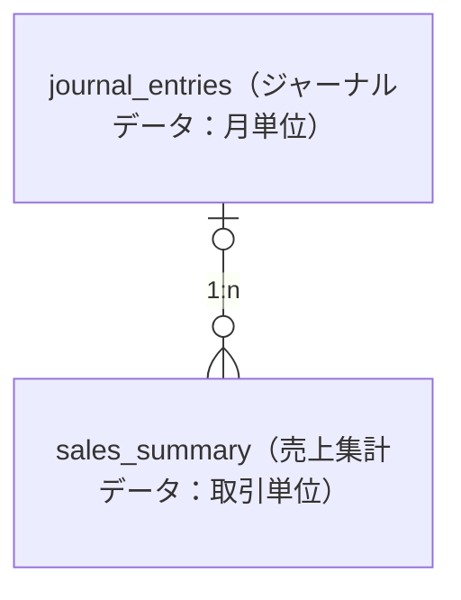

# 調査テクニック・ツール

## 調査ツール一覧

| ツール | 用途 | 使用例 |
|--------|------|--------|
| Grep | 正確な文字列検索 | クラス名、関数名、テーブル名 |
| Glob | パターンマッチング | ファイル一覧取得 |
| SemanticSearch | 概念的探索 | 「認証の仕組み」など |
| Git Blame | コード変更履歴 | 誰がいつ変更したか |
| Git Log | コミット履歴 | 実装経緯の追跡 |
| BigQuery | アクセスログ分析 | 実際の利用状況 |
| Redash | データベースクエリ | データ確認 |
| Slack検索 | 過去の議論の追跡 | 実装背景の理解 |
| チケットシステム | 実装背景の確認 | Redmine、Jira |

## 可視化ツール

| ツール | 用途 |
|--------|------|
| Mermaid | フローチャート、シーケンス図、ER図 |
| ASCII図 | シンプルな図 |
| テーブル | 構造化データ、比較表 |
| スクリーンショット | 実際の画面や動作確認 |

## 分析手法

| 手法 | 用途 |
|------|------|
| 5 Whys | 根本原因分析 |
| データドリブン | クエリ結果、ログ分析で裏付け |
| 工数比較 | 複数の選択肢を工数で比較 |
| 影響範囲分析 | 変更が及ぶ範囲を特定 |
| 段階的アプローチ | リスクの高い変更を段階的に実施 |

---

## 実践テクニック

### アクセスログからの利用状況分析

```sql
-- BigQueryでアクセス頻度を確認
SELECT
  _TABLE_SUFFIX AS date,
  agent,
  COUNT(*) AS cnt
FROM `project.dataset.production_table_*`
WHERE _TABLE_SUFFIX BETWEEN '20260101' AND '20260110'
  AND path LIKE '%/api/cart/ssladd%'
GROUP BY date, agent
ORDER BY date ASC, cnt DESC
```

判断基準:

- 0件: 完全に使われていない → 撤去可能
- 1-10件/日: ほぼ使われていない → 撤去検討
- 100件以上/日: 現役 → 修正対応

### データベースクエリでデッドコード特定

```sql
-- 期限切れクーポンの確認
SELECT promo_kbn, end_date, status
FROM M_PROMO
WHERE promo_kbn IN (1001, 1002, 1003, ...)
```

判断:

- すべて期限切れ → デッドコード確定
- 一部有効 → 条件付き撤去

### コードの論理的矛盾の発見

```ruby
# nilチェックと値チェックをANDで実施
if promo.nil? && promo.amount > 0
  # このブロックは絶対に実行されない
end
```

判断: 論理的に到達不可能なコード → 機能していない

### Slack/チケットからの経緯追跡

```markdown
- 古いiOSアプリを想定して旧カートAPIを残しているらしい
  - https://slack.example.com/archives/CE28P13C5/p1627448255004600
- 主なステークホルダーは経理チームだが、誰も使ってない機能ということになり、バッチを止めたらしい
  - https://slack.example.com/archives/C04D9HHDA1G/p1759119456340989
```

効果: なぜその実装になったか、現在の状況を理解

### 動作確認の記録

```markdown
- 動作テスト
  - `クーポン管理 > クーポン詳細`にアクセスして、利用件数を正しくカウントできていることを確認
  - https://app.test.example.com/user/promo-detail/?id=160510
    
```

効果: 実際に動作することを証明

### ER図で関係性を整理



効果: テーブル間の関係性を一目で理解できる

### cron設定の確認

```markdown
- `毎月1日の午前2時` にバッチ実行される
  - [config/cron/batch_server.yml#L49](リポジトリへのリンク)
```

効果: バッチの実行タイミングを正確に把握

### 論理的矛盾の指摘

```markdown
- `transactions.promo`に金額が入っているのに`promo_data` が存在しないケースをチェックしている
- しかし、promo_dataの`NULLチェック`と`値チェック`をANDで実施しており、必ず`false`になるため機能していない
  - [EG_CHECK_INVALID_DATA.php#L666-671](GitLabリンク)
```

効果: 実装バグを論理的に証明
